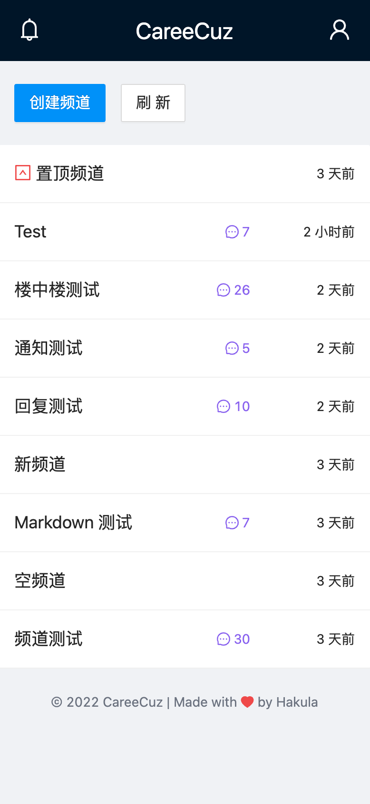
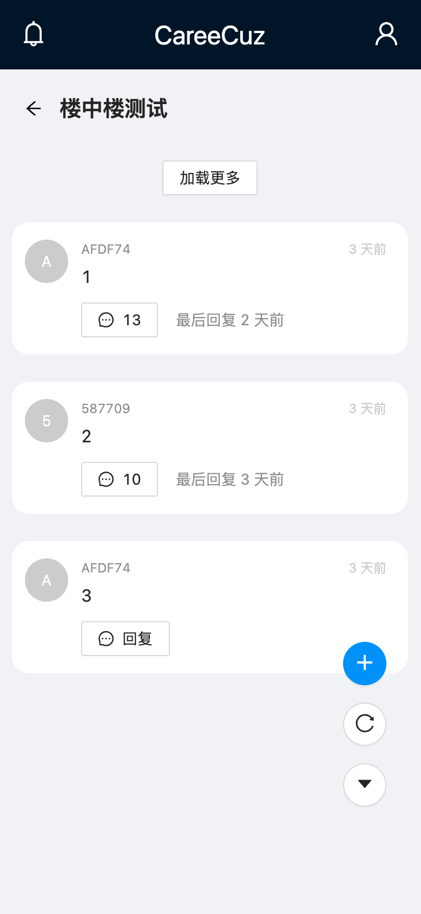
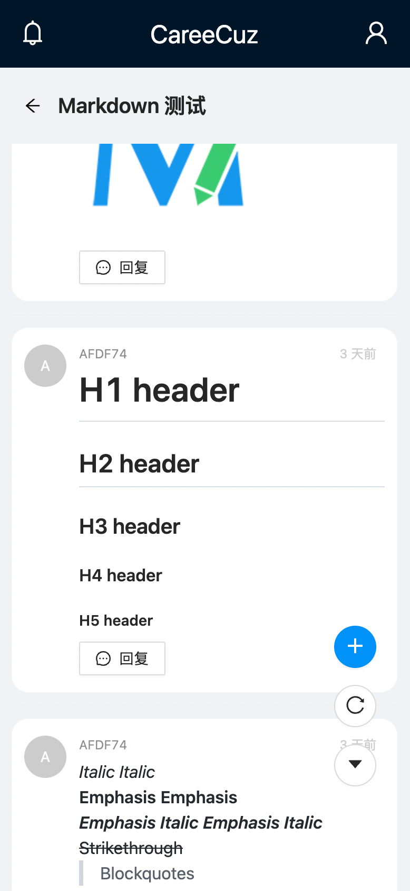
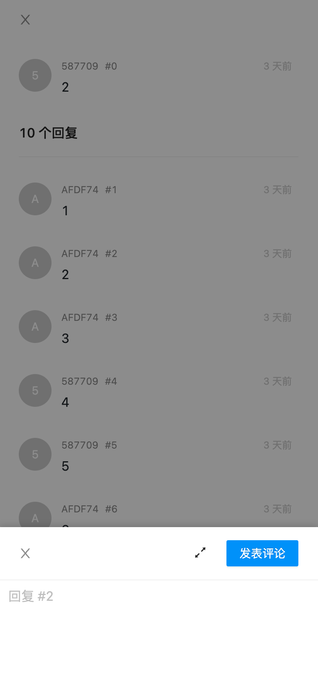

<!-- markdownlint-disable MD033 -->

# CareeCuz Frontend

一个匿名的校招求职交流平台。前端基于 Vue 3，使用 TypeScript 编写。

  
  
  
  

## 目录

- [CareeCuz Frontend](#careecuz-frontend)
  - [目录](#目录)
  - [功能总览](#功能总览)
  - [运行方法](#运行方法)
  - [贡献者](#贡献者)
  - [许可协议](#许可协议)

## 功能总览

- [x] 用户注册 / 登录
  - 使用邮箱和密码进行注册 / 登录
  - 用户均为匿名，仅以 ID 区别身份，用户名、头像基于 ID 自动生成
  - 前端使用 Vuex 进行 session 管理，全站无 cookie
  - 后端使用 Redis 缓存 token，用户最后一次使用的 7 天后 token 过期，届时需重新登录
  - 用户数据存储在 MongoDB 数据库中
- [x] 邮箱验证
  - 仅支持校园邮箱，以实现用户筛选
  - 后端使用 SendGrid 发送邮件，限制同一 IP 在 1 分钟内仅能发送 1 次，前后端均有校验
  - 后端使用 Redis 缓存验证码，1 小时后过期
- [x] 频道系统
  - 整体的架构设计参考 Slack，层级结构为：频道 (Channel) > 讨论串 (Thread) > 消息 (Message)
  - 支持频道置顶，其余频道按最新回复时间的顺序排序
  - 频道数据存储在 MongoDB 数据库中
- [x] 回复系统
  - 支持频道内回复和楼中楼回复，频道内点击右下角加号、楼中楼内点击消息即可开始回复
  - 回复消息支持**实时推送**，利用 Socket.IO 的 Room 机制实现消息的广播和屏蔽
  - 回复界面使用抽屉弹出，支持全屏输入
  - 消息内容支持 Markdown 语法
  - 使用 Socket.IO 实现消息传递
- [x] 楼中楼（讨论串）系统
  - 频道内点击消息即可展开楼中楼，使用抽屉弹出
  - 楼中楼内支持楼层显示，回复关系按楼层展示
  - 消息数据存储在 MongoDB 数据库中，保存频道 ID 和楼中楼 ID 字段，利用 mongoose 的 `populate` 方法实现嵌套查询（此处对嵌套查询的性能优化是后端的主要难点）
- [x] 通知系统
  - 回复消息后，被回复方将收到一条通知，通知支持**实时推送**
  - 点击通知后，将自动跳转到对应楼中楼页面
  - 未实时查看的通知也可以点击左上角的通知按钮展示
  - 通知数据存储在 MongoDB 数据库中
- [x] 前端部署
  - 前端使用 Vercel 配合 GitHub CI 实现自动化部署
- [x] 后端部署
  - 后端部署在 VPS 上，使用 PM2 进行部署，支持崩溃自动拉起

## 运行方法

首先在根目录下新建文件 `.env.production.local`，随后根据 `.env.template` 的模版指定各环境变量。开发环境下此值为 `ws://localhost:5050`。

- 安装依赖：执行 `./scripts/prebuild.sh`
- 编译构建：执行 `./scripts/build.sh`
- 启动：执行 `./scripts/start.sh`
- 停止：执行 `./scripts/stop.sh`

随后在浏览器打开 `http://localhost:7070` 即可访问。

## 贡献者

- [**Hakula Chen**](https://github.com/hakula139)<[i@hakula.xyz](mailto:i@hakula.xyz)> - 复旦大学

## 许可协议

本项目遵循 GNU General Public License v3.0 许可协议，详情参见 [LICENSE](./LICENSE) 文件。
